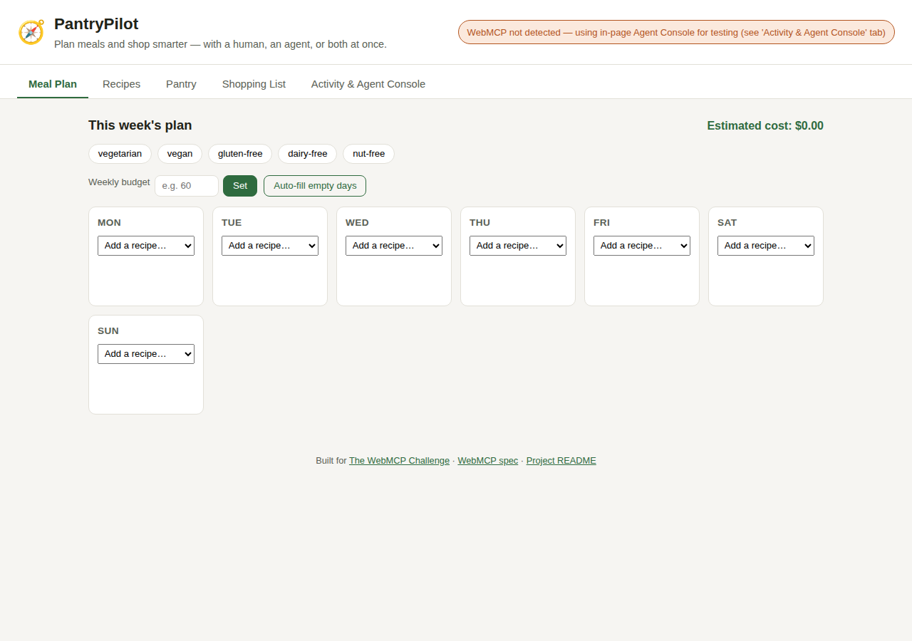
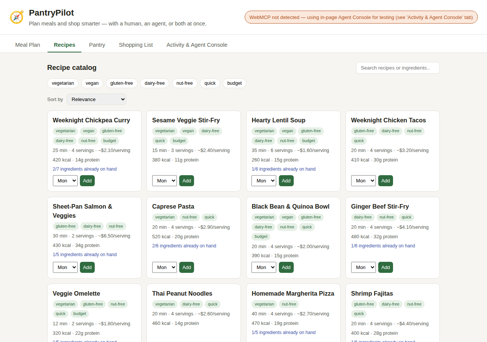
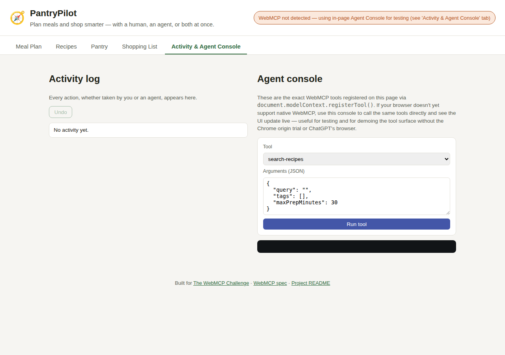

# How to Use PantryPilot

**Live demo:** [zingy-hamster-1df2ed.netlify.app](https://zingy-hamster-1df2ed.netlify.app/)

There's nothing to install and no account to create — it's a static page.
Open the link above and it works immediately.

## As a human

Click through the tabs like any normal app:

1. **Meal Plan** — pick a recipe for each day from the dropdown, set dietary
   preferences (vegetarian, vegan, gluten-free, dairy-free, nut-free), set a
   weekly budget, or click **Auto-fill empty days** to let the built-in
   planner fill the rest of the week for you.
2. **Recipes** — search and filter the catalog; sort by "what I already
   have," "uses expiring items," lowest cost, fastest, or lowest calories.
3. **Pantry** — check off what's in stock, and optionally give an item an
   expiry date so the planner can prioritize using it up.
4. **Shopping List** — auto-generated from the week's plan, offset by what's
   already in the pantry.





## As an agent

This is the actual point of the app: everything above is also exposed as
**19 WebMCP tools** via `document.modelContext.registerTool()`, so an agent
can do all of it directly instead of clicking through the UI.

### Enabling WebMCP to see it live

WebMCP isn't broadly available in browsers yet. To see the page register
its tools natively:

1. Use **Chrome 149 or later**.
2. Go to `chrome://flags/#enable-webmcp-testing` and set it to **Enabled**,
   then relaunch Chrome. (Or, once generally available, join the
   [WebMCP origin trial](https://developer.chrome.com/blog/ai-webmcp-origin-trial)
   for production use — no flag needed.)
3. Open the [live demo](https://zingy-hamster-1df2ed.netlify.app/). The
   badge in the top-right of the header will read **"✓ WebMCP tools
   registered natively"** instead of the fallback message.
4. Point a WebMCP-aware agent client (or ChatGPT's in-app browser) at the
   page and ask it to do something like: *"I'm vegetarian, my budget is
   $40 this week, plan the rest of my days and build the shopping list."*
   Watch the plan, nutrition summary, and shopping list update live while
   it works.

!!! note "About the screenshots on this page"
    They were captured from this exact codebase running locally rather
    than fetched live over the network, and they show the **fallback**
    state (see below) — the automated tooling used to generate this
    documentation runs on a Chromium build older than 149, so
    `document.modelContext` isn't implemented there yet and can't render
    the native badge. The UI is pixel-identical either way; only that one
    badge in the header changes. Follow the steps above in a real Chrome
    149+ browser to see it for yourself.

### Trying it without a WebMCP-capable browser

Every tool is also reachable through an in-page **Agent Console**, on the
**Activity & Agent Console** tab. It calls the exact same handler functions
that `document.modelContext.registerTool()` would have wired up — so it's
not a simplified demo, it's the real tool implementation, just reachable
through a manual form instead of an LLM deciding the calls.



To try it:

1. Open the **Activity & Agent Console** tab.
2. Pick a tool from the dropdown — for example `plan-week`.
3. Edit the JSON arguments, e.g.:
   ```json
   { "maxCaloriesPerServing": 500, "prioritizeExpiring": true }
   ```
4. Click **Run tool** and watch the result, then switch back to **Meal
   Plan** to see the week fill in live.

See the [tool reference](tools.md) for the full list and their arguments.
